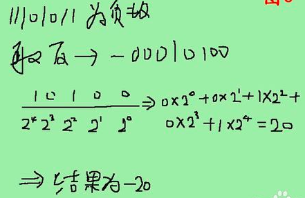

## 十进制转二进制
- 正数转二进制   
**除二取余，然后倒序排列，高位补零**   
   
`42所对应二进制就是101010`
- 负数转二进制   
**先是将对应的正整数转换成二进制后，对二进制取反，然后对结果再加一**

- 小数转换为二进制   
**对小数点以后的数乘以2，有一个结果吧，取结果的整数部分（不是1就是0喽），然后再用小数部分再乘以2，再取结果的整数部分……以此类推，直到小数部分为0或者位数已经够了就OK**   
   
`如果小数的整数部分有大于0的整数时该如何转换呢？如以上整数转换成二进制，小数转换成二进制，然后加在一起就OK了`
   
- 整数二进制转换为十进制   
   - 正整数   
**首先将二进制数补齐位数，首位如果是0就代表是正整数，如果首位是1则代表是负整数**   

   - 负整数  
   **若二进制补足位数后首位为1时，就需要先`减1`取反再换算**   
   ~~图片有问题~~   
   
- 小数的二进制转换为十进制   
   **将二进制中的四位数分别于下边对应的值相乘后相加得到的值即为换算后的十进制**
   
